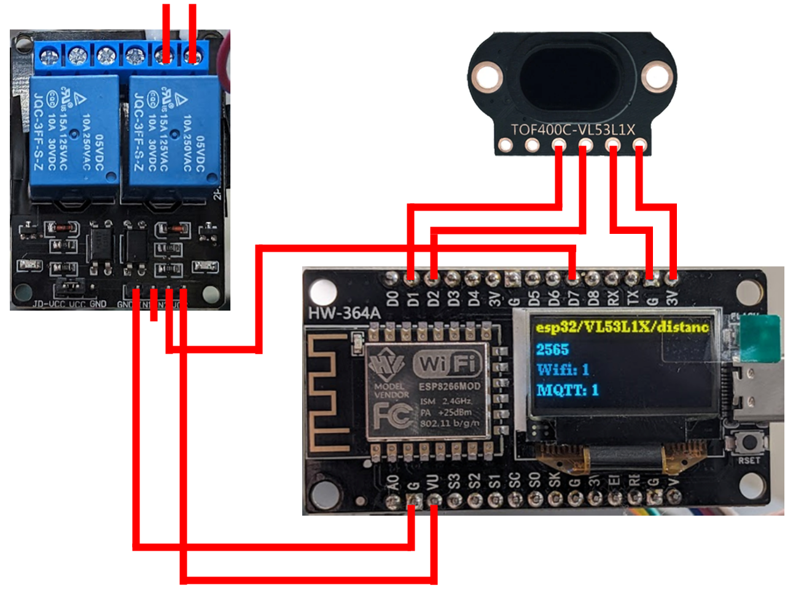
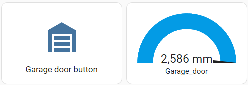

# Smart garage door opener

Upgrade your conventional garage door to a smart one! This project integrates your garage door opener equipped with an external switch contact (e.g. Novoport) seamlessly into your smart home environment using MQTT, specifically designed for use with Home Assistant.

## Hardware

To implement this project, you'll need the following hardware components:
- NodeMCU ESP8266 developement board with OLED display
- Time of Flight (ToF) sensor - TOF400C-VL53L1X
- 2-channel relay module 5V with optocoupler low-level trigger


## Circuit



## Explaination

To open the garage door, you usually only need to connect two contacts on its control panel. This can be easily achieved using a relay. This project is based on an ESP8266 microcontroller, which is integrated into the local network via Wifi. In terms of smart control, the position of the garage door is monitored with a distance sensor (TOF400C-VL53L1X). Data is exchanged with Home Assistant via a running MQTT broker. ESPHome could also be used as an alternative platform for this project. However, the current integration offers more flexibility for further improvements.

## Setting Up

### 1. Code Configuration
Navigate to `/src/main.cpp` to configure the `EspMQTTClient` section. Input your WiFi and MQTT settings accordingly. The used ESP8266 board has an OLED screen based on the "u8g2" libary which I use for debugging purposes.

### 2. Home Assistant Setup
Ensure you have an operational MQTT broker in Home Assistant accessible via username and password within your local network.

In your `configuration.yaml`, add the following MQTT devices:

```
mqtt:
  sensor:
      unique_id: garage_door_status
      name: "Garage_door"
      state_topic: "garage_door/VL53L1X/distance_mm"
      unit_of_measurement: "mm"

  button:
      unique_id: garage_door_button
      name: "Garage door putton"
      command_topic: "garage_door/relay"
      payload_press: "pulse"
      qos: 2
      retain: false
```


Then you can create for example a [`Horizontal stack Card`](https://www.home-assistant.io/dashboards/horizontal-stack) on the home screen.

```
type: horizontal-stack
cards:
  - show_name: true
    show_icon: true
    type: button
    tap_action:
      action: toggle
    entity: button.open_garage_door
    icon: mdi:garage
  - type: gauge
    entity: sensor.garage_door
    unit: mm
    min: 230
    max: 2580
    needle: true
```




## Dependencies

- [EspMQTTClient: MQTT and Wifi handling for ESP8266 and ESP32](https://github.com/plapointe6/EspMQTTClient)
- [U8g2: Library for monochrome displays](https://github.com/olikraus/u8g2)
- [VL53L1X: time-of-flight distance sensor libary](https://github.com/pololu/vl53l1x-arduino)

## License

Distributed under the MIT License.


## Contact

Eric Breitbarth