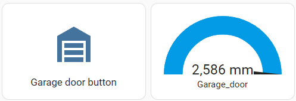

# Smart garage door opener

Upgrade your conventional garage door into a smart one! This project seamlessly integrates your garage door opener with an external switch contact (e.g., Novoport) into your smart home environment using MQTT, specifically tailored for use with Home Assistant.

## Hardware

To implement this project, you'll need the following hardware components:
- NodeMCU ESP8266 developement board with OLED display
- Time of Flight (ToF) sensor - TOF400C-VL53L1X
- 2-channel relay module 5V with optocoupler low-level trigger


## Circuit


## Explaination

To open the garage door, only two contacts need to be bridged. The project is based on an ESP8266 microcontroller, which is integrated into the local network via Wifi. Basically, only two contacts need to be bridged to open the garage door. This can of course be realised very easily using a relay. In terms of smart control, the position of the garage door is also monitored with a distance sensor (TOF400C-VL53L1X). Data is exchanged with home assistant via MQTT. An MQTT broker must be installed on the server computer for this.

Of course, ESPHome would be an alternative platform to realise this project. Later, however, limit switch positions should be queried and it should be possible to specify the position as a setpoint.

## Setting Up

### 1. Code Configuration
Navigate to `/src/main.cpp` to configure the `EspMQTTClient` section. Input your WiFi and MQTT settings accordingly. The used ESP8266 board has an OLED screen based on the "u8g2" libary which I use for debugging purposes.

### 2. Home Assistant Setup
Ensure you have an operational MQTT broker in Home Assistant accessible via username and password within your local network.

In your `configuration.yaml`, add the following MQTT devices:

```
mqtt:
  sensor:
      unique_id: garage_door_status
      name: "Garage_door"
      state_topic: "esp32/VL53L1X/distance_mm"
      unit_of_measurement: "mm"

  button:
      unique_id: garage_door_button
      name: "Garage door putton"
      command_topic: "esp32/garage_door/relay"
      payload_press: "pulse"
      qos: 2
      retain: false
```


Then you can create for example a[`Horizontal stack Card`](https://www.home-assistant.io/dashboards/horizontal-stack) on the home screen.

```
type: horizontal-stack
cards:
  - show_name: true
    show_icon: true
    type: button
    tap_action:
      action: toggle
    entity: button.restart_bedroom_switch
    icon: mdi:garage
  - type: gauge
    entity: sensor.garage_door
    unit: mm
    min: 180
    max: 2500
    needle: true
```




## License

Distributed under the MIT License.


## Contact

Eric Breitbarth